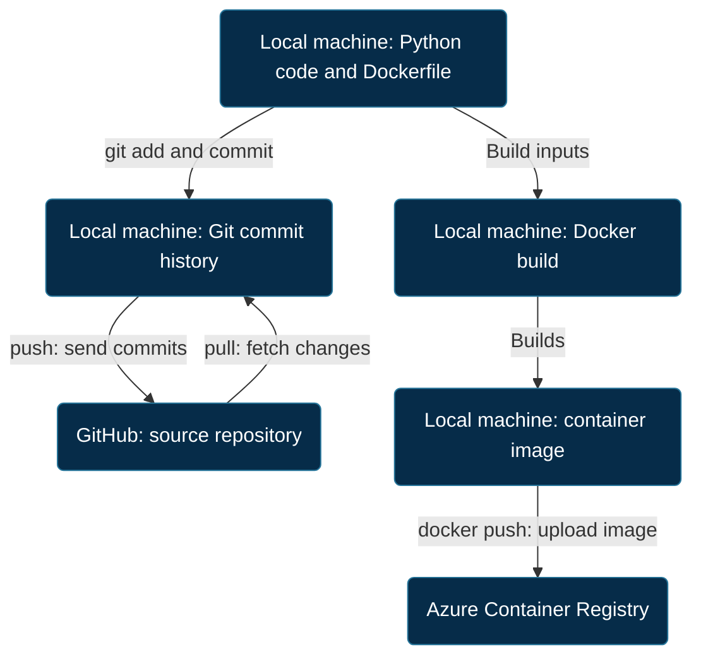
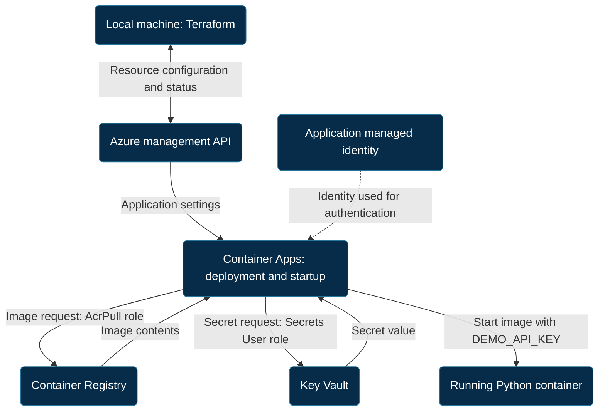

# Azure Terraform Platform

A hands-on Azure infrastructure project focused on Cloud Engineer skills: Infrastructure as Code, containers, identity, secrets, monitoring and troubleshooting.

**Status: learning environment, in progress — 10 September 2026.** A small Python API runs on Azure Container Apps. Remote Terraform state and deployment automation are the next milestones. This is not a production-ready reference architecture.

## What is implemented

- Terraform-managed resource group, virtual network and delegated subnet in North Europe.
- Azure Container Apps Environment and a Python API with external HTTPS ingress.
- Azure Container Registry with its built-in admin account disabled.
- User-assigned managed identity with registry-scoped `AcrPull` access.
- Azure Key Vault with RBAC, a secret-reader role for the application and a secrets-management role for the provisioning user.
- A Key Vault reference exposed to the container as `DEMO_API_KEY`; the secret value is entered separately in the Azure portal.
- Log Analytics, live log inspection and request metrics.
- A subscription-wide €5 monthly budget created separately in the portal. A budget is an alert mechanism, not a spending cap.

The application uses 0.25 CPU and 0.5 GiB memory, with 0–1 replicas and single-revision mode. It can scale to zero when idle; other Azure resources can still incur costs.

## Architecture

### 1. Saving source code and publishing the container image



GitHub stores source history; Container Registry stores built images. They do not automatically update each other in the current project: the developer builds and pushes the image manually. The image-upload arrow shows the artifact's direction; transport acknowledgements are omitted. A Git pull also updates the local working files when changes are integrated.

### 2. How Azure starts the application



The managed identity is the application's Azure identity, not a network gateway. Its separately assigned roles authorize image and secret access. The dotted arrow represents identity association, not a data transfer. Container Apps retrieves the secret and injects it into the container environment; the current Python application does not call Key Vault directly.

These are logical workflow diagrams, not complete network traces. Image retrieval is part of deployment/startup, not every API request. At runtime, a client sends an HTTPS request to the stable app ingress, which forwards it to Python on port 8080; the response returns through ingress to the client. Console output is collected by the platform and delivered to Log Analytics.

The app runs in a Container Apps Environment integrated with a delegated VNet subnet. The application, registry and vault currently use public endpoints; VNet integration alone does not make them private.

### Who can access what?

| Identity | Target | Role | Purpose |
| --- | --- | --- | --- |
| Application managed identity | Container Registry | AcrPull | Retrieve the container image |
| Application managed identity | This application's Key Vault | Key Vault Secrets User | Read secret values |
| Terraform provisioning user | This application's Key Vault | Key Vault Secrets Officer | Add, read, update and delete secrets |

The managed identity is an access credential, not a network gateway. The current Python code does not call Key Vault directly: Container Apps supplies the secret through an environment variable.

## Repository guide

| Path | Purpose |
| --- | --- |
| `main.tf`, `variables.tf` | Base configuration and inputs |
| `network.tf` | Virtual network and delegated subnet |
| `monitoring.tf` | Log Analytics workspace |
| `container-environment.tf` | Container Apps Environment |
| `registry.tf` | Container registry and current Azure client configuration |
| `identity.tf` | Application identity and image-pull permission |
| `container-app.tf` | Runtime settings, ingress and Key Vault reference |
| `key-vault.tf` | Vault and secret-access roles |
| `outputs.tf` | Resource names and stable application URL |
| `app/` | Python application, Dockerfile and Docker ignore rules |

## Run the application locally

Requires Docker. Run from the repository root in PowerShell:

```powershell
docker build -t azure-platform-api:local ./app
docker run --detach --rm --name azure-platform-api --publish 8080:8080 azure-platform-api:local
Invoke-RestMethod http://localhost:8080/
Invoke-RestMethod http://localhost:8080/health
docker logs azure-platform-api
docker stop azure-platform-api
```

`/health` returns `status: healthy`. It currently tests request handling only; it does not validate Key Vault access or an external API. Local execution does not require the demo secret because the application does not yet consume it.

## Work with an existing Azure deployment

Requires Terraform, Azure CLI, the correct Azure permissions and the existing Terraform state. A fresh Git clone alone does **not** contain the current local state.

```powershell
az login
az account show --query name --output tsv
# Confirm the selected subscription before proceeding.
$env:ARM_SUBSCRIPTION_ID = az account show --query id --output tsv

# Initialize when setting up the working directory or changing its dependencies/backend.
terraform init
terraform fmt -check
terraform validate
terraform plan -out="changes.tfplan"
```

Review every proposed change before applying:

```powershell
terraform apply "changes.tfplan"
$appUrl = terraform output -raw container_app_url
Invoke-RestMethod "$appUrl/health"
```

The URL output uses `ingress[0].fqdn`, the application endpoint, rather than an individual revision endpoint. Local Docker does not need to run to access the Azure application.

### Fresh deployment is still a staged process

The environment was built incrementally. A clean rebuild needs infrastructure and access roles first, an image pushed to the registry, and the separately supplied `demo-api-key` secret before deploying the app that references them. The current repository must not be presented as a proven one-command bootstrap. Automating this sequence is planned.

## Verification performed

| Check | Observed result |
| --- | --- |
| Local `/` and `/health` requests | Successful JSON responses |
| Local console logs | GET requests with HTTP 200 |
| Azure `/health` through the stable endpoint | Successful response |
| Ten test requests and the Requests metric | Visible traffic spike |
| Secret availability inside the Azure container | Non-empty `DEMO_API_KEY`, without printing its value |

The secret check was run in the Azure container console:

```sh
python -c 'import os; print("Secret available" if os.getenv("DEMO_API_KEY") else "Secret missing or empty")'
```

This verifies environment-variable availability, not the validity of an external API credential. The API application itself does not yet use the key.

## Security and operational boundaries

- Secret values are not hardcoded in Terraform or application source. Container Apps retrieves the referenced value using the managed identity.
- Access is scoped separately: image pull permission does not imply access to secrets.
- `Key Vault Secrets User` is scoped to this application's vault and can read its secrets. Console access to the container can also expose runtime secrets, so it must be controlled.
- The current Secrets Officer assignment uses the Terraform caller's object ID. This must be reviewed before moving execution to a CI identity.
- State and plan files may contain sensitive information and are excluded from Git. `.terraform.lock.hcl` is committed; local `.terraform/`, state, plans, real `.tfvars` and `.env` files are excluded. Example files contain placeholders only.
- Terraform state is still local. Backups, remote storage and locking are planned.
- Public API user authentication, private endpoints, Application Insights, explicit health-probe configuration and a tested rollback procedure are not implemented.
- The demo uses Python's standard-library HTTP server and a single maximum replica. It is a learning workload, not a production availability design.

## Troubleshooting lessons

- Registered `Microsoft.App` after an initial `MissingSubscriptionRegistration` deployment failure.
- Resolved unexpected subnet and Consumption-profile plan changes by expressing the desired settings explicitly.
- Replaced the deprecated Key Vault RBAC argument with `rbac_authorization_enabled` after provider validation warned about it.
- Used a request to wake a scale-to-zero app before connecting to its console.
- Replaced the revision-specific URL output after an Azure 404; the stable app endpoint worked.

## Costs and cleanup

Stopping the workstation does not stop Azure resources. Scaling the application to zero does not remove registry, logging or other costs. Review Cost Management; budget notifications are delayed and do not shut services down.

Before deleting the learning environment, inspect the deletion plan:

```powershell
terraform plan -destroy
```

If deletion is intended, `terraform destroy` removes resources managed by this state. This can remove images and the vault containing the manually entered secret. Key Vault soft-delete and purge behavior depend on the configuration and provider settings. Resources outside the state, including the separately created budget, are not covered by this cleanup.

## Roadmap

- [x] Local container build and test
- [x] Azure infrastructure and container deployment
- [x] Managed identity and Key Vault reference
- [x] Runtime secret-availability check
- [x] Live logs, request metrics and a subscription budget
- [ ] Azure Storage remote state, access controls and recovery
- [ ] GitHub Actions validation, image build and deployment
- [ ] Federated CI authentication without a stored Azure password
- [ ] Repeatable fresh-deployment sequence and separate environment configuration
- [ ] Health probes, operational alerts and a controlled failure/rollback exercise

The priority is operating and explaining the cloud platform reliably, rather than expanding the demo application's feature set.